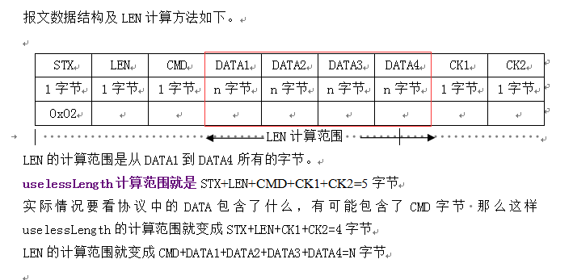
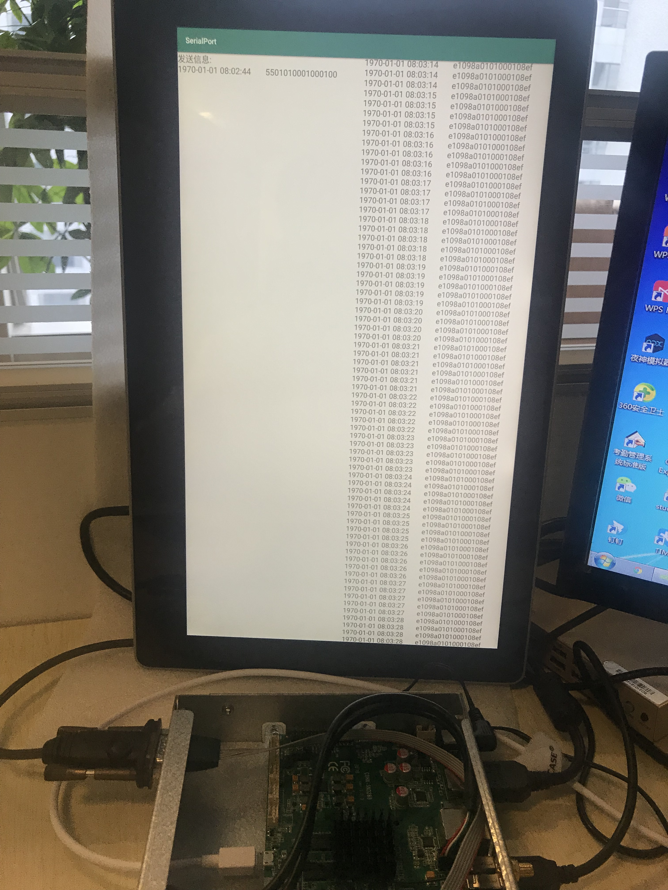

SerialPortHelper
========


[](https://github.com/cepr/android-serialport-api)
[](https://jitpack.io/#alanqjt/SerialPortHelper)

[](https://android-arsenal.com/api?level=15)


更新预告v2.0（为不兼容更新，更新时间大概在7月份左右）
---------
* 取消单例模式，支持同时打开多个串口
* so以Cmake动态生成，新增支持设置停止位，校验位，数据位...等等扩展参数
* 新增无协议的串口读写开启（可以理解为串口读到什么就返回什么，不会去做协议的过滤，协议逻辑要自己处理）


目录
====
* [引入](#引入)
* [使用说明](#使用说明)
* [属性说明](#属性说明)
* [效果演示](#效果演示)
* [项目成品](#项目成品)

引入
---------
* Android Studio

将[serialportlib](serialportlib)引入

```xml
dependencies {
     implementation project(path: ':serialportlib')
}
```

也可以直接

```xml
allprojects {
		repositories {
			...
			maven { url 'https://jitpack.io' }
		}
	}
```

```xml
dependencies {
     implementation 'com.github.alanqjt:SerialPortHelper:v1.0.2'
}
```

* Eclipse

还在使用Eclipse的你可以回家了!(把代码复制下来自己导入过去，但是还是建议赶紧把项目开发切换到Android Studio)


使用说明
---------
串口协议一般分为两种，第一种为固定长度，第二种为可变长度，而可变长度又分为两种。
所以此库能帮助您快速适配三种类型的协议,如果还是不能满足开发需求，可以自行修改serialportlib中的ReadThread(兄弟，我也只能帮你到这了)


* 第一种协议固定长度 PROTOCOLMODEL_FIXED

<br></br>
 


```Java
//协议模版
//请在串口调试助手发送E1 09 8A 01 01 00 01 08 EF

List<Integer> protocolHead = new ArrayList<>();
protocolHead.add(0xE1);
Parameter parameter = new Parameter(SERIALPATH, BAUDRATE, protocolHead, Parameter.PROTOCOLMODEL_FIXED, new OnSerialPortDataListener() {
    @Override
    public void onDataReceived(byte[] bytes, int length, String hexData) {
               
    }

    @Override
    public void onDataSent(byte[] bytes, int length, String hexData) {
                
    }
});
parameter.setProLenIndex(1);
parameter.setProtocolLength(9);
SerialHelper.getInstance().serialStart(parameter);
```


* 第二种协议固定长度 PROTOCOLMODEL_VARIABLE
<br></br>
1.data包含了所要截取的长度

<br></br>
 

```Java
//协议模版
//请在串口调试助手发送E1 09 8A 01 01 00 01 08 EF
//ProLenIndex 所在的下标是1，  值为0x09
List<Integer> protocolHead = new ArrayList<>();
protocolHead.add(0xE1);
Parameter parameter = new Parameter(SERIALPATH, BAUDRATE, protocolHead, Parameter.PROTOCOLMODEL_VARIABLE, new OnSerialPortDataListener() {
    @Override
    public void onDataReceived(byte[] bytes, int length, String hexData) {
               
    }

    @Override
    public void onDataSent(byte[] bytes, int length, String hexData) {
               
    }
});
parameter.setProLenIndex(1);//设置LEN下标
SerialHelper.getInstance().serialStart(parameter);

```

<br></br>
2.data不包含了所要截取的长度，指的是有意义的数据长度

<br></br>
 


```Java
//协议模版
//请在串口调试助手发送E1 05 8A 01 01 00 01 08 EF
//请在串口调试助手发送55 05 8A 01 01 00 01 08 EF
List<Integer> protocolHead = new ArrayList<>();
protocolHead.add(0xE1);
protocolHead.add(0x55);
Parameter parameter = new Parameter(SERIALPATH, BAUDRATE, protocolHead, Parameter.PROTOCOLMODEL_VARIABLE, new OnSerialPortDataListener() {
    @Override
    public void onDataReceived(byte[] bytes, int length, String hexData) {
               
    }

    @Override
    public void onDataSent(byte[] bytes, int length, String hexData) {
               
    }
});
parameter.setProLenIndex(1);//设置LEN下标
parameter.setUselessLength(4);//除了data有效数据外的长度
SerialHelper.getInstance().serialStart(parameter);
```


* 发送数据

```Java
SerialHelper.getInstance().sendData(data);
```


* 监听多种协议开头

```Java
List<Integer> protocolHead = new ArrayList<>();
protocolHead.add(0xE1);
protocolHead.add(0x55);
Parameter parameter = new Parameter(SERIALPATH, BAUDRATE, protocolHead, Parameter.PROTOCOLMODEL_VARIABLE, new OnSerialPortDataListener() {
    @Override
    public void onDataReceived(byte[] bytes, int length, String hexData) {
               
    }

    @Override
    public void onDataSent(byte[] bytes, int length, String hexData) {
               
    }
});
```


* 读写线程消息队列缓存长度

```Java
//发送数据队列长度
parameter.setQueueSizeBySend(100);//默认缓存100

//监听数据队列长度
parameter.setQueueSizeByReceived(100);//默认缓存100
```


* 读写线程消息处理并发处理速度

```Java
//发送数据间隔
parameter.setFrequencyBySend(200);//默认间隔为200毫秒

//监听数据间隔
parameter.setFrequencyByReceived(200);//默认间隔为200毫秒
```


* 修改权限地址

```Java
parameter.setSuPath("/system/xbin/su");
```


* 启动串口

```Java
SerialHelper.getInstance().serialStart(parameter);
```

* 关闭串口

```Java
SerialHelper.getInstance().close();
```


* 获取串口设备

```Java
SerialHelper.getInstance().getAllSerialDevices();
```


* 获取串口设备地址

```Java
SerialHelper.getInstance().getAllSerialDevicesPath();
```


* 查看日志

```Java
parameter.setDebug(true);
```


属性说明
---------

| 属性			|说明			 |
| ------------- |  :-------------|
| debug      			|	是否显示log		|
| suPath      			|	权限地址		|
| baudrate        |   波特率		|
| serialPath 		|	串口地址		|
| protocolHead 	|   协议开头		|
| protocolEnd 	|   协议结尾 	|
| protocolLength 			|   协议长度 	|
| proLenIndex 				|   协议长度截取的下标 从0开始	|
| protocolModel 			|   协议模型 	|
| uselessLength 			|   无用的数据长度 	|
| frequencyBySend 			|   写线程处理速度,  只能大于0 默认为200毫秒	|
| frequencyByReceived 			|   读线程处理速度,  只能大于0 默认为200毫秒 |
| queueSizeBySend 			|   写线程队列缓存长度, 只能大于0 默认为100	|
| queueSizeByReceived 			|   读线程队列缓存长度, 只能大于0 默认为100	|
| onSerialPortDataListener 			|   数据监听 |
| PROTOCOLMODEL_FIXED 			|   固定长度协议,  proLenIndex就没有意义了 |
| PROTOCOLMODEL_VARIABLE 			|   可变长度协议,  proLenIndex才有意义		|


效果演示
---------
* 并发处理
<br></br>
 
<br></br>
  

项目成品
---------
[地心科技-色秀口红机](http://www.gravitytech.com.cn/detail/60.html)
<br></br>
网红口红机
<br></br>
 

[云际科技-游云魔盒](http://www.baidu.com)
<br></br>
一种游艺设备，支持使用摇杆玩王者荣耀，和各种cocos2d,unity3d游戏。
<br></br>
 

[逗买科技-逗买智能售货机](http://www.ecxls.cn/invest.html)
<br></br>
弹簧售货机
<br></br>


[味都好-味都好智能售餐机](https://mp.weixin.qq.com/s/UUXSAPc5nk0tR5qW3nN03Q)
<br></br>
智能售餐机
<br></br>


# License
```
Copyright 2019 屈健涛

Licensed under the Apache License, Version 2.0 (the "License");
you may not use this file except in compliance with the License.
You may obtain a copy of the License at

   http://www.apache.org/licenses/LICENSE-2.0

Unless required by applicable law or agreed to in writing, software
distributed under the License is distributed on an "AS IS" BASIS,
WITHOUT WARRANTIES OR CONDITIONS OF ANY KIND, either express or implied.
See the License for the specific language governing permissions and
limitations under the License.
```


